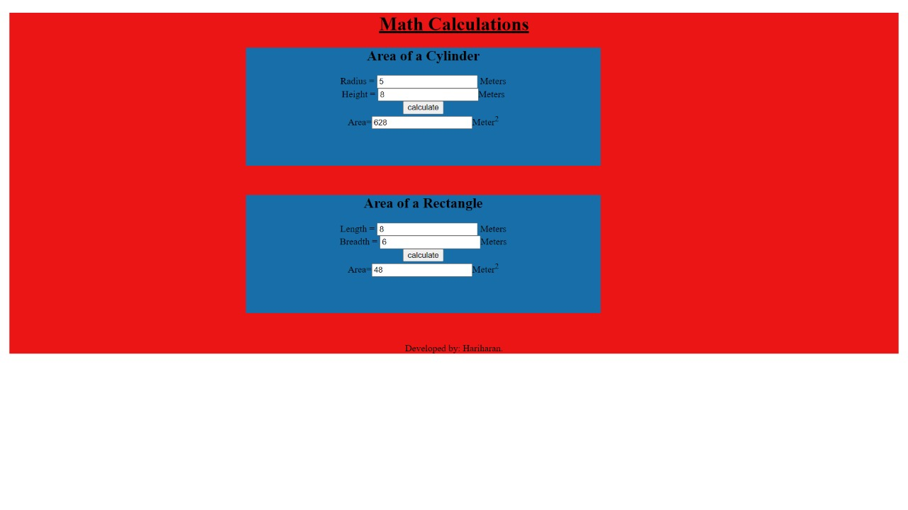

# AngularCalculation

# Web Page for Mathematical Calculations using Angular

## AIM:
To design a dynamic website to perform mathematical calculations using Angular Framwork

## DESIGN STEPS:

### Step 1:

Requirement collection.

### Step 2:

Creating the layout using HTML and CSS in component.html file

### Step 3:

Write typescript to perform the calculations.

### Step 4:

Validate the layout in various browsers.

### Step 5:

Validate the HTML code.

### Step 6:

Publish the website in the given URL.

## PROGRAM :
### cyclinder.component.htnl
~~~

    <h2>Area of a Cylinder</h2>
    Radius = <input  type="text" [(ngModel)]="radius"> Meters 
    Height = <input [(ngModel)]="height"type ="text">Meters 
    <input type="button" (click)="onCycCalculate()" value="calculate"> 
    Area=<input [value]="area" type="text" >Meter2

 
~~~
### cyclinder.component.ts
~~~
import { Component, OnInit } from '@angular/core';

@Component({
  selector: 'app-cylinder',
  templateUrl: './cylinder.component.html',
  styleUrls: ['./cylinder.component.css']
})
export class CylinderComponent implements OnInit {
  radius:number
  height:number
  area:number
  constructor() {
    this.radius = 0
    this.height = 0
    this.area = 2*22/7*this.radius*(this.radius+this.height)
   }
   onCycCalculate(){
    this.area = this.area = 3.14*this.radius*this.radius*this.height
   }
  ngOnInit(): void {
  }

}

~~~

### rectangle.component.html
~~~

    <h2>Area of a Rectangle</h2>
    Length = <input  type="text" [(ngModel)]="length"> Meters 
    Breadth = <input [(ngModel)]="breadth"type ="text">Meters 
    <input type="button" (click)="onCalculate()" value="calculate"> 
    Area=<input [value]="area" type="text" >Meter2

~~~
### rectangle.component.ts
~~~
import { Component, OnInit } from '@angular/core';

@Component({
  selector: 'app-rectangle',
  templateUrl: './rectangle.component.html',
  styleUrls: ['./rectangle.component.css']
})
export class RectangleComponent implements OnInit {
  length:number
  breadth:number
  area:number
  constructor() { 
    this.length = 0
    this.breadth = 0
    this.area = this.length*this.breadth;
  }
  onCalculate(){
    this.area = this.length*this.breadth;
}
  ngOnInit(): void {
  }

}

~~~
### app.component.css
~~~
.container{
  background-color: rgb(136, 212, 13);
  text-align: center;
  height: 720pxx;
}
.subcontainer{
  background-color: rgb(218, 169, 8);
  width: 600px;
  height: 200px;
  text-align: center;
  margin-left: 400px;
  margin-bottom: 50px;
}
h1{
  text-decoration: underline;
}
~~~
### app.component.html
~~~
<body>
  

      <h1>Math Calculations</h1>
      

        <app-cylinder></app-cylinder>
    

      

          
          <app-rectangle></app-rectangle>
      

      
      

          Developed by: Hariharan
      

  

</body>
~~~
### app.module.ts
~~~
import { NgModule } from '@angular/core';
import { BrowserModule } from '@angular/platform-browser';
import { FormsModule } from '@angular/forms';

import { AppRoutingModule } from './app-routing.module';
import { AppComponent } from './app.component';
import { RectangleComponent } from './rectangle/rectangle.component';
import { CylinderComponent } from './cylinder/cylinder.component';

@NgModule({
  declarations: [
    AppComponent,
    RectangleComponent,
    CylinderComponent
  ],
  imports: [
    BrowserModule,
    AppRoutingModule,
    FormsModule
  ],
  providers: [],
  bootstrap: [AppComponent]
})
export class AppModule { }
~~~

## OUTPUT:

## Result:
This is code is executed successfully to create a webpage to make mathematical calculations using angular.
